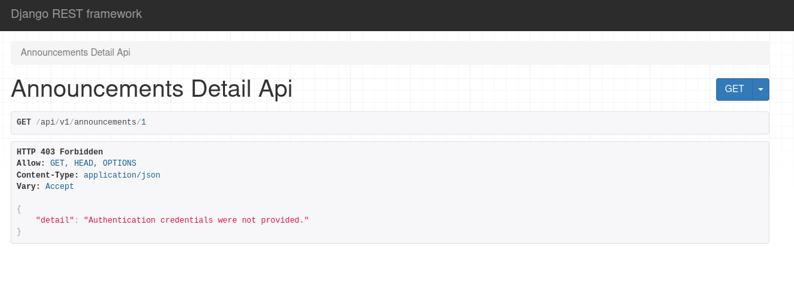
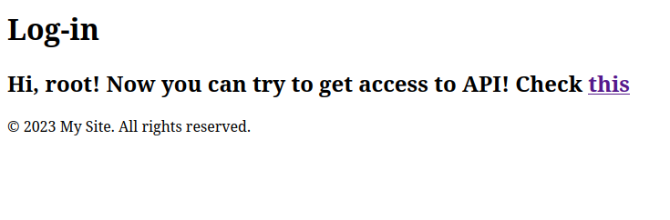
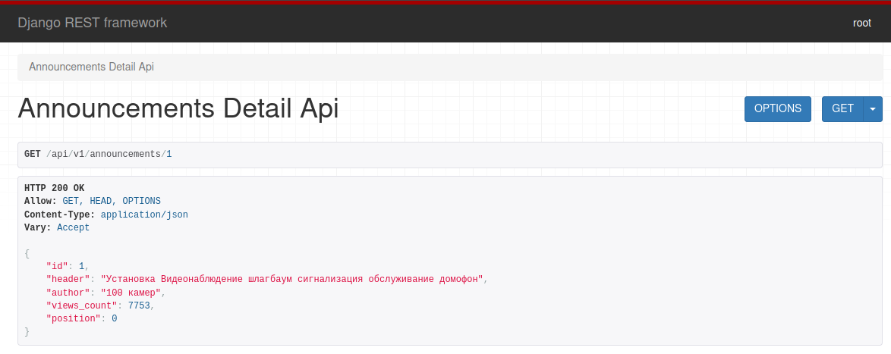

# Тестовое задание на позицию Backend-разработчик на языке Python.
Требуется разработать API-сервис для получения данных о первых 10 объявлениях по ссылке https://www.farpost.ru/vladivostok/service/construction/guard/+/Системы+видеонаблюдения/ .

## Реализация
В данном задании было выполнено:
- Использование Django ORM для работы с базой данных SQLite
- Сервис использует принципы ООП
- Сервис написан на Django + DjangoRestFramework
- Написаны минимальные тесты к АПИ (tests/APITests.py)
- Написаны скрипты для заполнения бд
- Реализована система регистрации и входа (верификации аккаунта) для подключения к API
- Реализовано API для объявлений (DetailView, в коде так же есть закоментированный участок с реализацией ListView).

Роуты:
- `/api/v1/announcements/1` - апи для доступа к объявлениям
- `/auth/register` - страница для создания аккаунта
- `/auth/login` - страница для входа в аккаунт

## Тестовый запуск
### С использованием docker-compose
- выполнить `sudo docker-compose up` в корневой директории проекта.
- открыть браузер и ввести `127.0.0.1:8000` в адресную строку. 

### С запуском тестового сервера
- выполнить:
```
pip install -r requirements.txt
cd apitask
python3 manage.py migrate
python3 manage.py test
python3 manage.py < scripts/load_database.py
python3 manage.py runserver
```


## Ожидаемая логика работы
- перейдите на `/api/v1/announcements/1`. Ожидаемое поведение: Что, к слову, логично, ведь использование апи разрешено исключительно авторизованным пользователям. Самое время стать одним из таких пользователей.
- перейдите на `auth/register` и заполните пустые поля. Для теста подойдут username: root, password: ea6uquqF.
- в случае успеха, нас редиректит на `auth/login`, где мы сможем авторизироваться: 
- после чего нам будет открыт доступ по вышеупомянутому пути `/api/v1/announcements/1`.

